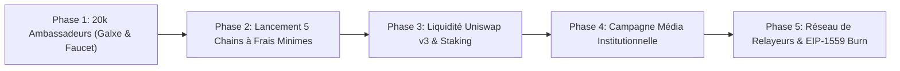

# CAHIER DE STRATÉGIE ET STRATÉGIE GO-TO-MARKET (GTM)
## LABYRINTH PROTOCOL V1 — Confidentialité ZK, Real Yield & Tokenomics $LAB

---

> 📌 **DOCUMENT STRATÉGIQUE LOCAL INTERNE (ÉQUIPE FONDATEUR)**
> Ce document rassemble la feuille de route marketing, le plan d'acquisition d'utilisateurs via Galxe (20 000 Ambassadeurs), la stratégie multi-chain à frais minimes (Arbitrum, Base, Optimism, Polygon, BNB Chain) et la politique de domaine personnalisé (`.com` / `.io`).

---

### 🗺️ STRATÉGIE GTM EN 5 PHASES (*GO-TO-MARKET BLUEPRINT*)

---

### 1️⃣ PHASE 1 : Campagne Galxe & Cohorte des 20 000 Ambassadeurs (*Pioneer Campaign*)
- **Plateforme & Canal** : Galxe (`galxe.com`) + Nom de domaine personnalisé institutionnel (`labyrinthprotocol.io` / `.app` / `.com`).
- **Objectif** : Transformer 20 000 early adopters en véritables ambassadeurs du projet.
- **Paramètres Économiques Capping** :
  - **Nombre d'Ambassadeurs Capped** : **20 000 Wallets uniques**.
  - **Allocation par Wallet Éligible** : **1 000 $LAB Mainnet** (soumis à un vesting linéaire de 6 mois avec 25% au TGE pour éviter tout dump).
  - **Pool d'Airdrop Cible** : 20 000 000 $LAB (exactement 2,0% de la réserve globale de 1 Milliard).
  - **Badge NFT 3D** : Badge *"Privacy Pioneer"* offrant +15% de rendement supplémentaire en staking.

---

### 2️⃣ PHASE 2 : Lancement Multi-Chain à Frais Minimes *(5 Blockchains Frayeur < $0.05)*
- **Objectif** : Éviter les frais élevés d'Ethereum Mainnet au lancement et garantir des retraits anonymes ultra-rapides.
- **Réseaux Cibles au Lancement** :
  1. **Arbitrum One** (Frais < $0.02 - Volume ZK élevé)
  2. **Base L2** (Frais < $0.01 - Écosystème Coinbase)
  3. **Optimism (OP)** (Frais < $0.03 - Superchain)
  4. **Polygon (POL/MATIC)** (Frais < $0.01 - Adoption massive)
  5. **BNB Chain (BSC)** (Frais < $0.05 - Très grande liquidité asiatique)
- **Frais de Déploiement** : Pris en charge facilement en raison des coûts symboliques sur ces 5 réseaux.
- **Ethereum Mainnet & Tron** : Réservés pour une phase ultérieure afin d'accueillir les baleines institutionnelles (*Whales*).

---

### 3️⃣ PHASE 3 : Lancement de la Liquidité & Staking $LAB (*Uniswap v3*)
- **Objectif** : Établir une liquidité saine et inciter à la détention à long terme du jeton $LAB.
- **Actions** :
  1. Injecter la liquidité initiale sur **Uniswap v3** via `scripts/deploy_uniswap_liquidity.js` (Ratio: 10M $LAB + 1 ETH à $0.0003/LAB).
  2. Verrouiller les jetons LP pendant 12+ mois via Uncx ou Team Finance (garantie anti-rugpull).
  3. Activer le staking DAO `LabyrinthGovernance.sol` pour distribuer les 80% de rendements réels aux stakers de $LAB.

---

### 4️⃣ PHASE 4 : Positionnement Média *"Clean Privacy"* (Narrative Institutionnel)
- **Objectif** : Différencier Labyrinth de Tornado Cash en promouvant la conformité opt-in.
- **Angle Média** : *"Labyrinth Protocol : La première plateforme de confidentialité ZK avec rendement auto-généré et certificat de conformité PoI"*.
- **Cibles Média** : CoinTelegraph, Decrypt, Bankless, CryptoSlate.

---

### 5️⃣ PHASE 5 : Volant d'Inertie du Réseau de Relayeurs (*Growth Flywheel*)
- **Objectif** : Décentraliser les retraits gasless et verrouiller massivement des jetons $LAB.
- **Actions** :
  1. Permettre aux relayeurs tiers de staker au moins **10 000 $LAB** dans `LabyrinthRelayer.sol`.
  2. Chaque transaction de retrait prélève des frais en $LAB réacheminés vers le rachat et le burn EIP-1559.
