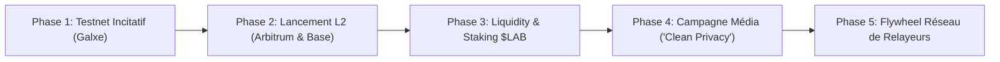

# CAHIER DE STRATÉGIE ET STRATÉGIE GO-TO-MARKET (GTM)
## LABYRINTH PROTOCOL V1 — Confidentialité ZK, Real Yield & Tokenomics $LAB

---

> 📌 **DOCUMENT STRATÉGIQUE LOCAL INTERNE**
> Ce document rassemble la feuille de route marketing, la stratégie de liquidité et le plan d'acquisition d'utilisateurs pour le lancement commercial de Labyrinth Protocol.

---

### 🗺️ STRATÉGIE GTM EN 5 PHASES (*GO-TO-MARKET BLUEPRINT*)

---

### 1️⃣ PHASE 1 : Campagne Bêta-Test Incitative (*Pioneer Privacy Campaign*)
- **Plateforme** : Galxe / Zealy / Guild.xyz
- **Objectif** : Générer une communauté initiale de 5 000+ utilisateurs engagés sans dépenses marketing prématurées.
- **Actions** :
  1. Inviter la communauté à effectuer des opérations de mixage de test sur Ethereum Sepolia.
  2. Éditer des attestations de conformité ZK Proof of Innocence (PoI).
  3. Distribuer des badges NFT exclusifs (*"Privacy Pioneer"*) offrant un multiplier de récompenses lors du futur staking $LAB.

---

### 2️⃣ PHASE 2 : Lancement Stratégique Multi-Chain *(Arbitrum One & Base L2)*
- **Objectif** : Offrir des retraits anonymes ultra-rapides pour moins de $0.05 de frais de gaz.
- **Actions** :
  1. Déployer les smart contracts sur **Arbitrum One** et **Base L2** d'abord (faible coût et volume élevé).
  2. Déployer ultérieurement sur **Ethereum Mainnet** pour capturer le volume des baleines (*Whales*).

---

### 3️⃣ PHASE 3 : Lancement de la Liquidité & Staking $LAB (*Uniswap v3*)
- **Objectif** : Établir une liquidité saine et inciter à la détention à long terme du jeton $LAB.
- **Actions** :
  1. Injecter la liquidité initiale sur **Uniswap v3** via `scripts/deploy_uniswap_liquidity.js` (Ratio: 10M $LAB + 1 ETH à $0.0003/LAB).
  2. Verrouiller les jetons LP pendant 12+ mois via Uncx ou Team Finance (garantie anti-rugpull).
  3. Activer le staking DAO `LabyrinthGovernance.sol` pour distribuer les 80% de rendements réels aux stakers de $LAB.

---

### 4️⃣ PHASE 4 : Positionnement Média *"Clean Privacy"* (Narrative Institutionnel)
- **Objectif** : Différencier Labyrinth de Tornado Cash en promouvant la conformité opt-in.
- **Angle Média** : *"Labyrinth Protocol : La première plateforme de confidentialité ZK avec rendement auto-généré et certificat de conformité PoI"*.
- **Cibles Média** : CoinTelegraph, Decrypt, Bankless, CryptoSlate.

---

### 5️⃣ PHASE 5 : Volant d'Inertie du Réseau de Relayeurs (*Growth Flywheel*)
- **Objectif** : Décentraliser les retraits gasless et verrouiller massivement des jetons $LAB.
- **Actions** :
  1. Permettre aux relayeurs tiers de staker au moins **10 000 $LAB** dans `LabyrinthRelayer.sol`.
  2. Chaque transaction de retrait prélève des frais en $LAB réacheminés vers le rachat et le burn EIP-1559.
