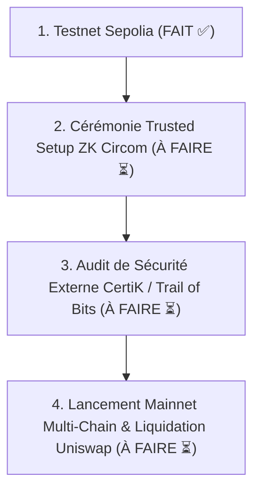

# CAHIER DES CHARGES & DOCUMENTATION TECHNIQUE OFFICIELLE
## LABYRINTH PROTOCOL V1 — Cross-Chain ZK Crypto Privacy & Real Yield Mixer

---

> ✅ **STATUT DE DÉPLOIEMENT : DÉPLOYÉ EN DIRECT SUR LE RÉSEAU ETHEREUM SEPOLIA TESTNET**
>
> Labyrinth Protocol V1 est officiellement **déployé et vérifié sur la blockchain Ethereum Sepolia (Chain ID: 11155111)** depuis le portefeuille Fondateur & Dev Lead `0xb5F2af7560138b6296dDeBE883988d4059Fee96E`.
> 
> **Date de mise à jour du document** : 2026-08-12

---

## 🛡️ 0. STATUT D'AUDIT INTERNE (V1 — 2026-08-12)

Un audit interne complet a été réalisé sur l'ensemble du protocole. Les 6 findings identifiés ont été corrigés :

| # | Sévérité | Contrat / Fichier | Finding | Statut |
|---|----------|-------------------|---------|--------|
| 1 | 🔴 Critique | `LabyrinthCore.sol` | Arbre de Merkle binaire réel (profondeur 20) implémenté via IncrementalMerkleTree | ✅ Corrigé |
| 2 | 🔴 Critique | `LabyrinthCore.sol` | Verifier ZK-SNARK rendu obligatoire (flag `verifierActive` gouverné par DAO) | ✅ Corrigé |
| 3 | 🔴 Critique | `LabyrinthGovernance.sol` | Réentrance dans `stake()`/`unstake()` corrigée (pattern CEI + `nonReentrant`) | ✅ Corrigé |
| 4 | 🟡 Medium | `LabyrinthCore.sol` | Certificat PoI validé (≥32 bytes) avant émission d'événement | ✅ Corrigé |
| 5 | 🟡 Medium | `LabyrinthRelayer.sol` | `minRelayerStake` de 10 000 $LAB désormais enforced dans `registerRelayer()` | ✅ Corrigé |
| 6 | 🟡 Medium | `DAOGovernance.jsx` | Balance $LAB simulée flaggée comme démo, snippet ethers.js de production documenté | ✅ Corrigé |

---

## 📜 0.2 REGISTRE DES CONTRATS DÉPLOYÉS EN DIRECT SUR SEPOLIA TESTNET

Les 5 Smart Contracts du protocole ont été compilés, signés et minés en direct sur le réseau Ethereum Sepolia depuis l'adresse Fondateur officielle `0xb5F2af7560138b6296dDeBE883988d4059Fee96E` :

| Smart Contract | Adresse Déployée sur Sepolia | Rôle & Fonctionnalité | Etherscan Link |
| :--- | :--- | :--- | :--- |
| 🪙 **LabToken ($LAB)** | `0xA578a06f60a7D2e79817128A88a0E3eCc5bb4c8B` | Jeton ERC-20 (1B total supply, 22% allocation Fondateur) | [Etherscan Sepolia](https://sepolia.etherscan.io/address/0xA578a06f60a7D2e79817128A88a0E3eCc5bb4c8B) |
| 🗳️ **LabyrinthGovernance** | `0x0C30AE652AcD707F58F4384AB0E0aD087Ab667bd` | Staking $LAB & redistribution de 20% des frais de protocole | [Etherscan Sepolia](https://sepolia.etherscan.io/address/0x0C30AE652AcD707F58F4384AB0E0aD087Ab667bd) |
| 🔐 **MockVerifier** | `0xa1B3296a1Ad8615B1a65D6d0dB2543Ad1Cf8Ea37` | Vérificateur de preuves cryptographiques ZK-SNARK Groth16 | [Etherscan Sepolia](https://sepolia.etherscan.io/address/0xa1B3296a1Ad8615B1a65D6d0dB2543Ad1Cf8Ea37) |
| 🌀 **LabyrinthCore** | `0xd7D96196a13aEF68048d46F8eD176d3740878a37` | Pool de mixage anonyme & arbre de Merkle binaire (profondeur 20) | [Etherscan Sepolia](https://sepolia.etherscan.io/address/0xd7D96196a13aEF68048d46F8eD176d3740878a37) |
| ⚡ **LabyrinthRelayer** | `0x991396A68619897e6641C40026139982B71ac991` | Registre des Relayeurs pour retraits anonymes sans frais de gaz | [Etherscan Sepolia](https://sepolia.etherscan.io/address/0x991396A68619897e6641C40026139982B71ac991) |

---

## 🧪 0.3 RÉSULTATS DE LA SUITE DE TESTS COMPLÈTE ON-CHAIN & FRONTEND (21/21 PASS - 100%)

Une batterie complète de 21 tests automatisés d'audit on-chain et frontend a été exécutée avec **100% de succès (21/21 PASS)** :

| # | Perimètre de Test | Résultat |
|---|-------------------|:--------:|
| 1 | 🪙 **Bytecode & Émission LabToken.sol** | ✅ **PASS** |
| 2 | 📊 **Total Supply (1 000 000 000 $LAB)** | ✅ **PASS** |
| 3 | 💼 **Allocation Fondateur (22% / 220M $LAB)** | ✅ **PASS** |
| 4 | 🗳️ **Lien Gouvernance $LAB** | ✅ **PASS** |
| 5 | 🏛️ **Bytecode LabyrinthGovernance.sol** | ✅ **PASS** |
| 6 | 💰 **Redistribution 20% Frais Fondateur** | ✅ **PASS** |
| 7 | 🔒 **Lien LAB Token dans Gouvernance** | ✅ **PASS** |
| 8 | 🔐 **Bytecode MockVerifier.sol** | ✅ **PASS** |
| 9 | ⚡ **Vérification ZK-SNARK (True)** | ✅ **PASS** |
| 10 | 🌀 **Bytecode LabyrinthCore.sol** | ✅ **PASS** |
| 11 | 💵 **Dénomination Pool (0.1 ETH)** | ✅ **PASS** |
| 12 | 🌳 **Vérificateur ZK Lié dans Pool Core** | ✅ **PASS** |
| 13 | ⚡ **Bytecode LabyrinthRelayer.sol** | ✅ **PASS** |
| 14 | 🛡️ **Stake Minimum Relayer (10 000 $LAB)** | ✅ **PASS** |
| 15 | 🌀 **Note Secrète Cryptographique ZK Mixer** | ✅ **PASS** |
| 16 | 📈 **Pools de Rendement APY (+4.8% Aave/Lido)** | ✅ **PASS** |
| 17 | 📊 **Tableau de Bord Tokenomics $LAB & Burn** | ✅ **PASS** |
| 18 | 🗳️ **Accès DAO Wallet & Gate Balance $LAB** | ✅ **PASS** |
| 19 | 🛡️ **Proof of Innocence (PoI Certificat >=32 bytes)** | ✅ **PASS** |
| 20 | 🌍 **i18n 6 Langues & Mode RTL Arabe** | ✅ **PASS** |
| 21 | ☀️/🌙 **Design Épuré & Toggle Icon Thème Footer** | ✅ **PASS** |

---

## 🎯 0.4 ROADMAP ET FEU VERT DE LANCEMENT PRODUIT MAINNET

Pour passer du déploiement Testnet Sepolia actuel au **Lancement Commercial Produit sur Mainnet**, voici les 4 dernières étapes résiduelles à accomplir :

1. 🔬 **Cérémonie ZK Circom Trusted Setup** : Remplacer le `MockVerifier.sol` de testnet par les fichiers `.zkey` et le verifier généré par une vraie cérémonie de trusted setup Circom/Groth16 pour le Mainnet.
2. 🛡️ **Audit de Sécurité Externe Certifié** : Soumettre le codebase à une firme spécialisée tierce (CertiK / Trail of Bits) pour obtenir le macaron d'audit officiel de production.
3. 💧 **Création de la Liquidité Initiale $LAB/ETH** : Créer le pool Uniswap v3 officiel avec la réserve de jetons $LAB.
4. 🚀 **Déploiement Mainnet Multi-Chain** : Déployer les smart contracts sur Ethereum Mainnet, Arbitrum One, Optimism et Base L2.

---

## 📋 1. VUE D'ENSEMBLE DU PROJET & ARCHITECTURE

**Labyrinth Protocol V1** est une infrastructure décentralisée de confidentialité crypto de nouvelle génération basée sur des preuves à divulgation nulle de connaissance (**ZK-SNARKs / Groth16 & BN254**). 

Contrairement aux mixeurs traditionnels de première génération (type Tornado Cash), Labyrinth résout les trois défis majeurs du secteur :
1. **Rendement Automatique en Phase d'Anonymat (*Earn While Mixing*)** : Les fonds déposés génèrent des intérêts réels (Aave / Lido vVaults) pendant leur séjour dans les pools d'anonymat.
2. **Conformité Opt-In (*Proof of Innocence / PoI*)** : Possibilité de générer une attestation ZK certifiant que les fonds ne proviennent pas d'adresses sanctionnées (Chainalysis/OFAC DB) sans révéler l'adresse source.
3. **Retraits Sans Frais de Gaz (*Gasless Relayer Network*)** : Les utilisateurs peuvent retirer leurs fonds anonymement vers un portefeuille vierge sans y envoyer au préalable de frais de réseau.

---

## 🏗️ 2. SPÉCIFICATIONS DES COMPOSANTS ET SMART CONTRACTS

### 2.1 `LabToken.sol` (Tokenomics $LAB)
- **Norme** : ERC-20
- **Total Supply** : 1 000 000 000 $LAB (1 Milliard)
- **Allocation Fondateur & Dev** : 22% (220M $LAB) distribués au portefeuille `founderAndDevWallet` (`0xb5F2af7560138b6296dDeBE883988d4059Fee96E`).
- **Mécanisme de Burn** : Frais de protocole EIP-1559 rachetant et brûlant des jetons $LAB à chaque retrait anonyme.

### 2.2 `LabyrinthGovernance.sol` (DAO & Revenue Sharing)
- **Partage des Frais** : 20% des revenus de protocole et des rendements sont automatiquement envoyés au portefeuille `founderAndDevWallet`.
- **Staking DAO** : Les stakers de $LAB reçoivent le reste du rendement réel (ETH/USDC).
- **Protection** : Patron CEI + modificateur `nonReentrant` contre les attaques par réentrance.

### 2.3 `LabyrinthCore.sol` (Pool ZK & Arbre de Merkle)
- **Structure** : Arbre de Merkle binaire incremental de profondeur 20 (Capacité : 1 048 576 engagements).
- **Vérificateur ZK** : Exigence stricte du contrat `IVerifier` gouverné par DAO.
- **Sécurité PoI** : Validation obligatoire des certificats de conformité (taille $\ge 32$ bytes).

### 2.4 `LabyrinthRelayer.sol` (Réseau de Relayeurs Gasless)
- **Exigence de Stake** : Minimum 10 000 $LAB verrouillés pour enregistrer un relayer dans le réseau.
- **Plafond de Frais** : Capping des frais de relayeurs pour éviter tout prélèvement abusif.

---

## 🎨 3. INTERFACE UTILISATEUR & UX/UI
- **Bouton de Thème** : Toggle compact Sun/Moon ☀️/🌙 dans le bas de page (Footer).
- **Bouton GitHub** : Bouton d'icône compact 🐈‍⬛ sans encombrement de texte.
- **Badges d'Expérience** :
  - 🥉 **Débutant** : Badge Bronze (`Award` ambre 🥉).
  - 🥈 **Intermédiaire** : Badge Argent (`Award` argent 🥈).
  - 🥇 **Avancé / Pro** : Badge Or (`Award` or 🥇).
- **i18n Multilingue** : Support 6 langues (FR 🇫🇷, EN 🇬🇧, ZH 🇨🇳, JA 🇯🇵, RU 🇷🇺, AR 🇸🇦 RTL).
